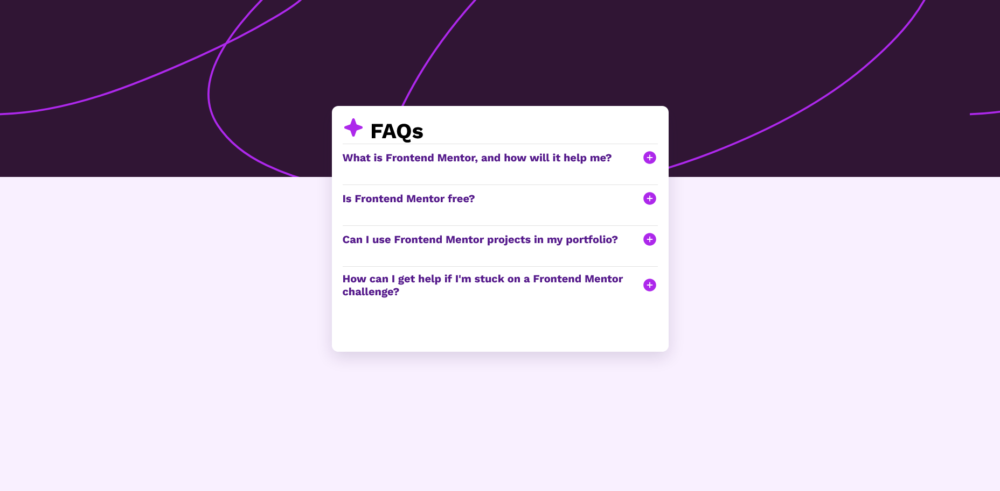

# Frontend Mentor - FAQ accordion solution

This is a solution to the [FAQ accordion challenge on Frontend Mentor](https://www.frontendmentor.io/challenges/faq-accordion-wyfFdeBwBz). Frontend Mentor challenges help you improve your coding skills by building realistic projects. 

## Table of contents

- [Frontend Mentor - FAQ accordion solution](#frontend-mentor---faq-accordion-solution)
  - [Table of contents](#table-of-contents)
  - [Overview](#overview)
    - [The challenge](#the-challenge)
    - [Screenshot](#screenshot)
    - [Links](#links)
  - [My process](#my-process)
    - [Built with](#built-with)
    - [What I learned](#what-i-learned)
  - [Author](#author)

**Note: Delete this note and update the table of contents based on what sections you keep.**

## Overview

### The challenge

Users should be able to:

- Hide/Show the answer to a question when the question is clicked
- Navigate the questions and hide/show answers using keyboard navigation alone
- View the optimal layout for the interface depending on their device's screen size
- See hover and focus states for all interactive elements on the page

### Screenshot

### Links

- Solution URL: [Add solution URL here](https://github.com/EKriley-ci/faq-accordion-main.git)
- Live Site URL: [Add live site URL here](https://ekriley-ci.github.io/faq-accordion-main/)

## My process

### Built with

- Semantic HTML5 markup
- CSS custom properties
- Flexbox
- CSS Grid
- Mobile-first workflow

### What I learned

in this projet i learn the importante of :target, i wasn't knwo beffore how useful it is. for me all interaction were was need js but with the target code you can do this like all the interaction on this projet juste in css

It's was my first time using this so i can't telle you more about this, but if you want to know more about this there is the ressource were helpe me : https://developer.mozilla.org/en-US/docs/Web/CSS/CSS_media_queries/Using_media_queries

Fun fact: Before doing this challenge, I learned how to structure HTML to properly use the `:target` selector. You can check out an example in the [`test/index.html`](./test/index.html) file.
## Author

- Frontend Mentor - [@yourusername](https://www.frontendmentor.io/profile/EKriley-ci)